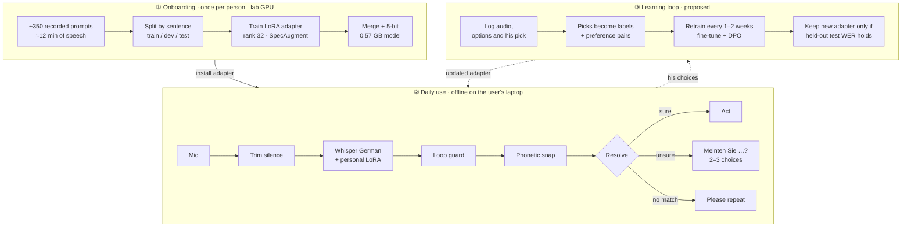

# Personal Voice Control for atypical speech using LoRA

Speech recognition that learns one person's voice from 12 minutes of
recordings, runs offline on a laptop, and never acts on a command it is unsure
of.

**[View the full overview →](https://alejandroniculescu.github.io/irregular_voice_google/)** · **Code:** setup, recording, training and demos are in [docs/USAGE.md](docs/USAGE.md).

## TL;DR

**How well it works.** Standard German speech recognition got more than half
the words wrong for our first user (55.4% word error rate). With **12
minutes** of his recordings, a personal adapter and a sound-based correction
step bring that down to **10.7%**, about 5× fewer errors. Spelling-level
accuracy is **96%** (4.0% character error rate). In a replay of 15 commands
the system carried out **0 wrong commands**: when it was unsure, it asked.

**Why this is the right approach.**
- *Personal, not generic.* Adapters don't carry over between people: our
  adapter makes other speakers with dysarthria worse (60.6% → 109.4% error).
  Everyone needs their own model, so the product is a fast way to make one.
- *The errors left are near misses.* After adaptation, words are wrong but
  letters are mostly right (13.2% word vs 4.3% character errors), e.g.
  *geklabt* for *geklappt*. That is exactly what sound-based matching fixes,
  and it does: 13.2% → 10.7%.
- *Safe by design.* When the system is unsure it offers 2–3 choices
  ("Meinten Sie …?") instead of guessing, so a mistake costs one tap, not a
  wrong action.
- *About 100× less data for the same result.* The closest published study
  [1] needed 22.5 hours of one German speaker's speech to reach 10.7% WER;
  with 1.4 hours it reached 15.8%. We reach 10.7% with 12 minutes. (Different
  speaker and test set; an equal-footing test on their data is next.) Google's Project Euphonia found 3–4 minutes per person enough
  for home control for 63% of speakers [4].

**How it scales.**
- *Short onboarding:* ~350 short prompts (~12 min of speech), then a scripted
  pipeline trains, compresses and installs a 0.57 GB personal model.
- *Private and cheap to run:* daily recognition runs offline on an ordinary
  laptop, with no cloud service; recordings are used only for training on a
  trusted machine.
- *Gets better with use (next):* each choice the user makes becomes training data,
  so the model improves at home without new recording sessions.
- *Less recording per new user (planned):* a shared starting model trained on many
  speakers, with a small personal adapter on top.
- *Beyond Whisper:* a **wav2vec2** version is next (it cannot loop or invent
  fluent text), then an **ImageBind** experiment that matches the sound of a
  command to its meaning directly and can later add lip video.

**Model:** [whisper-large-v3-turbo-german-lora (q5_0, whisper.cpp)](https://huggingface.co/alejandroniculescu/whisper-large-v3-turbo-german-lora-20260923-182243-q5_0.bin)

The user is anonymized. No audio or transcripts of his speech are in this
repository; examples here are generic German words.

## Results

Held-out test set: 39 recordings of sentences never seen in training.

| System | Word errors (WER) | Character errors (CER) |
| --- | ---: | ---: |
| Standard German Whisper | 55.4% | 24.4% |
| + sound-based correction | 53.7% | 24.8% |
| + personal adapter (12 min) | 13.2% | 4.3% |
| **+ personal adapter + sound-based correction** | **10.7%** | **4.0%** |

Command replay (15 commands): 12 carried out correctly, 2 confirmed by the
user and then carried out correctly, 1 asked to repeat, **0 wrong actions**.

Does one person's adapter help others? No. On 125 recordings of other German
speakers with dysarthria, the standard model has 60.6% WER and our user's
adapter 109.4%. (WER above 100% means more wrong or extra words than the
sentence has.)

## How it works

## Why sound-based correction: the WER–CER gap

- **After adaptation, errors are small.** WER 13.2% but CER only 4.3%: most
  wrong words are off by a letter or two (*geklabt* for *geklappt*, *Seben* for
  *Sieben*). Kölner Phonetik gives such near misses the same sound code, and a
  weighted edit distance prefers the likely confusions (voicing, a silent h,
  doubled consonants). Correction lowers WER 13.2% → 10.7%.
- **Before adaptation, errors are too large.** CER 24.4%: whole words are
  wrong, and correction barely helps (55.4% → 53.7%).
- **So the order matters:** the adapter gets the output close in sound, then
  sound-based correction finishes the job.

## Learning from each choice

When unsure, the system shows 2–3 options. Each pick gives the correct text for
that recording, plus the wrong texts the model found plausible.

1. **Confirmed labels:** picked option + audio become new training data.
2. **Preference learning:** picked vs rejected options train the model to
   prefer the right one (Direct Preference Optimization, DPO).
3. **Tuning:** picks adjust the correction costs and when to ask.

Safeguards: always a "none of these" option; train only on the user's own
choices; a fixed test set, so a new model ships only if it is at least as
good; a carer or therapist can review picks; consent for storing daily-use
audio.

## Roadmap

1. **Equal-footing comparison:** run our pipeline with 12 minutes of the
   published study's speaker [1, 20] and score it on their test set.
2. **Least data that works:** results with 2, 5 and 12 minutes of recordings.
3. **More users:** 10–20 German speakers with dysarthria from different causes.
4. **Shared starting model:** trained on many speakers, plus a small personal
   adapter, to cut recording time per new user.
5. **Home use with the learning loop:** measure wrong actions, confirmations
   and error rate over weeks.
6. **wav2vec2 version** of the recognizer (CTC, German XLS-R), compared
   directly with Whisper on the same data.
7. **ImageBind experiment:** match the sound of a command to its meaning, as a
   second opinion next to the transcript; later add lip video. (ImageBind's
   weights are licensed for research only.)
8. **Smarter correction:** use context to choose between sound-alike words,
   and check the extra German sound-variant rules on more speakers.
9. **Acoustic profile** per user (formants, pitch, voice quality, rate) to
   predict how much adaptation will help.

## Technical details

Algorithm inventory

Status: ✅ measured in the best system · 🔧 built, not used in best model ·
❌ tried, made things worse · 💡 proposed.

| Layer | Algorithm | Module | Evidence | Status |
| --- | --- | --- | --- | --- |
| Data | Recording protocol: sustained vowel, pa-ta-ka (DDK), free speech, Grandfather passage, commands; phone recorder over HTTPS + token | `recorder.py` | 352 clips: 278 train (11.9 min), 35 dev, 39 test | ✅ |
| Data | Split by transcript hash, so a sentence never lands in two splits | `manifest.py` | All numbers here | ✅ |
| Acoustic | Silence trimming, 16 kHz mono | `preprocess.py` | Dev WER raw 58.4% → trim 57.7% | ✅ |
| Acoustic | High-shelf EQ, tempo ×1.2 | `preprocess.py` | 59.1% / 62.0%, worse | ❌ |
| Acoustic | Augmentation: speed, low-pass, reverb, noise, gain | `augment.py` | Not yet evaluated | 🔧 |
| Acoustic | Synthetic speech (TTS, slowed, low-passed) | `synth.py` | Not yet evaluated | 🔧 |
| Model | Base: primeline/whisper-large-v3-turbo-german (4-layer decoder, weak language prior) | — | Dev WER 57.7% | ✅ |
| Model | LoRA r=32, α=64, dropout 0.05 on q/k/v/out/fc1/fc2, encoder + decoder; lr 5e-4, 10 epochs, patience 3 | `train.py` | Dev WER 59.1% → 13.9% | ✅ |
| Model | SpecAugment (5% time, 5% frequency masks) | `train.py` | In best run | ✅ |
| Model | DoRA | `train.py --dora` | Not yet compared | 🔧 |
| Model | Merge + ggml q5_0, whisper.cpp on Metal | `ggml.py`, `cpp.py` | 0.57 GB, same WER as f16 | ✅ |
| Model | Learning from the user's choices (labels + DPO) | — | Choices already offered | 💡 |
| Decoding | Loop guard: token cap by clip length, repeat collapse | `guard.py` | Stopped a 137% WER blow-up | ✅ |
| Decoding | Personal phrase prompt | `questions.py` | Dev 57.7% → 54.7% (base) | ✅ |
| Decoding | Per-question soft GBNF grammar | `questions.py` | Command dialog | ✅ |
| Decoding | Token confidence (min p < 0.5 → confirm) | `questions.py` | Resolve step | ✅ |
| Phonetic | Kölner Phonetik | `phonetic.py` | Basis of snap | ✅ |
| Phonetic | Weighted edit distance (voicing, h, doubling at half cost) | `snap.py` | Ranks candidates | ✅ |
| Phonetic | Non-word snap (wordfreq) + command snap | `snap.py` | Test WER 13.2% → 10.7% | ✅ |
| Phonetic | Loose German sound variants (vocalized r, lost s, ch/sch, pf, umlauts) | `phonetic.py` | Dev 11.0% → 8.8%, test unchanged | 🔧 |
| Linguistic | Local LLM rewrite gated by sound | `llmfix.py` | Dev 10.9% → 15.3% | ❌ |
| Linguistic | LM rescoring of snap candidates | — | Design ready | 💡 |
| Dialog | Resolve: accept / confirm / repeat, up to 3 choices | `questions.py` | 0 wrong commands in 15 | ✅ |
| Dialog | Home-control slot dialog (device, room, action) | `home.py` | Live demo | ✅ |
| Evaluation | WER/CER with German normalization (ß→ss, digits, letter names, hyphens) | `text.py`, `evaluate.py` | Adapter 14.9% → 13.2% | ✅ |
| Evaluation | Cross-speaker transfer test | `scripts/external_dysarthric_german.py` | 109.4% vs 60.6% | ✅ |

Levels of analysis

| Level | Used today | Proposed |
| --- | --- | --- |
| Acoustic | Log-mel inside Whisper; trimming; augmentation | Formants F1/F2, vowel space area, FCR; eGeMAPS (openSMILE) |
| Voice quality | — | F0, jitter, shimmer, HNR (Praat/parselmouth) |
| Prosody / timing | Loop guard uses clip length | Speech rate, pauses, DDK rate |
| Phonetic | Weighted dysarthric edit distance | Learn confusion costs per speaker |
| Phonemic | Kölner Phonetik + German variants | G2P + forced alignment (Montreal Forced Aligner) |
| Lexical | wordfreq non-word detection; personal phrases | Personal vocabulary from accepted commands |
| Syntactic / semantic | Per-question grammars; slot filling | LM rescoring of phonetic candidates |
| Pragmatic | Confirm before acting | Per-user confirmation threshold |

## Related work

| Work | Setup | Result | Relevance |
| --- | --- | --- | --- |
| Huber, Kernahan & Waibel 2026 [1] | One German dysarthric speaker, Whisper full fine-tuning, 92 h + 8.8 h corrections | 15.8% (1.4 h), 10.7% (22.5 h), 9.7% (all + corrections) | Closest work. We use 12 min (different speaker and test set, not directly comparable). Corrections help, supporting our learning loop. |
| Project Euphonia [2–5] | English, >1M utterances, per-speaker models | Up to 85% lower WER; beats human listeners on short phrases | 63% of speakers reach target WER for home automation with 3–4 min [4] |
| VI LoRA [6] | Bayesian LoRA; UA-Speech + German child | More data-efficient | Alternative adapter; uncertainty for when to ask |
| Eckert & Schuppler 2025 [7] | Austrian German child, ataxic dysarthria | Small-data comparison | German small-data case |
| Baskar et al. 2022 [8]; AdAIS [9] | wav2vec2 + speaker-adaptive features, German validation | Gains across severity | wav2vec2 baseline family |
| ISi-Speech [10] | German speech-training app (BMBF) | App "Sprechen!" | Existing German work in the space |
| Rexeis et al. 2012 [11] | Acoustic + lexical adaptation | Early German work | Historical baseline |

## References

1. Huber, C., Kernahan, L., & Waibel, A. (2026). Adapting Foundation ASR Models to Dysarthric Speech: A Case Study. [arXiv:2606.31722](https://arxiv.org/abs/2606.31722)
2. Google Research. [Project Euphonia](https://sites.research.google/euphonia/about/)
3. Shor, J., et al. (2019). Personalizing ASR for Dysarthric and Accented Speech with Limited Data. Interspeech 2019. [arXiv:1907.13511](https://arxiv.org/abs/1907.13511)
4. Tobin, J., & Tomanek, K. (2022). Personalized Automatic Speech Recognition Trained on Small Disordered Speech Datasets. ICASSP 2022. [arXiv:2110.04612](https://arxiv.org/abs/2110.04612)
5. Green, J. R., et al. (2021). Automatic Speech Recognition of Disordered Speech: Personalized Models Outperforming Human Listeners on Short Phrases. Interspeech 2021. [ISCA](https://www.isca-archive.org/interspeech_2021/green21_interspeech.html)
6. Variational Low-Rank Adaptation for Personalized Impaired Speech Recognition (2025). [arXiv:2509.20397](https://arxiv.org/abs/2509.20397)
7. Eckert, L., & Schuppler, B. (2025). Automatic Speech Recognition for a Dysarthric Child Speaking Austrian German. Forum Acusticum Euronoise 2025. [PDF](https://dael.euracoustics.org/confs/fa2025/data/articles/000168.pdf)
8. Baskar, M. K., et al. (2022). Speaker adaptation for Wav2vec2 based dysarthric ASR. Interspeech 2022. [arXiv:2204.00770](https://arxiv.org/abs/2204.00770)
9. [AdAIS: Adaptation of ASR for Impaired Speech with minimum resources](https://www.humane-ai.eu/project/tmp-012/). Humane AI Net.
10. Fraunhofer IDMT. [ISi-Speech](https://www.idmt.fraunhofer.de/en/institute/projects-products/projects/isi-speech.html)
11. Rexeis, S., Petrik, S., & Kubin, G. (2012). Automatische Spracherkennung für Sprecher mit Dysarthrie. DAGA 2012.
12. Radford, A., et al. (2023). Robust Speech Recognition via Large-Scale Weak Supervision. ICML 2023. [arXiv:2212.04356](https://arxiv.org/abs/2212.04356)
13. Hu, E. J., et al. (2022). LoRA: Low-Rank Adaptation of Large Language Models. ICLR 2022. [arXiv:2106.09685](https://arxiv.org/abs/2106.09685)
14. Park, D. S., et al. (2019). SpecAugment. Interspeech 2019. [arXiv:1904.08779](https://arxiv.org/abs/1904.08779)
15. Postel, H. J. (1969). Die Kölner Phonetik. IBM-Nachrichten 19, 925–931.
16. Rafailov, R., et al. (2023). Direct Preference Optimization. NeurIPS 2023. [arXiv:2305.18290](https://arxiv.org/abs/2305.18290)
17. Rudzicz, F., Namasivayam, A. K., & Wolff, T. (2012). The TORGO database. Language Resources and Evaluation 46(4).
18. Kim, H., et al. (2008). Dysarthric speech database for universal access research (UASpeech). Interspeech 2008.
19. [Speech Accessibility Project](https://speechaccessibilityproject.beckman.illinois.edu/), University of Illinois.
20. [chuber/dysarthric-speech](https://huggingface.co/datasets/chuber/dysarthric-speech) (gated, CC BY-NC 4.0; dataset of [1]).
21. [B-Czarnetzki/dysarthric_german](https://huggingface.co/datasets/B-Czarnetzki/dysarthric_german) (no license stated; internal comparison only).
22. Liu, S.-Y., et al. (2024). DoRA: Weight-Decomposed Low-Rank Adaptation. ICML 2024. [arXiv:2402.09353](https://arxiv.org/abs/2402.09353)
23. Eyben, F., et al. (2016). The Geneva Minimalistic Acoustic Parameter Set (GeMAPS). IEEE Trans. Affective Computing 7(2).
24. McAuliffe, M., et al. (2017). Montreal Forced Aligner. Interspeech 2017.
25. Baevski, A., et al. (2020). wav2vec 2.0: A Framework for Self-Supervised Learning of Speech Representations. NeurIPS 2020. [arXiv:2006.11477](https://arxiv.org/abs/2006.11477)
26. Girdhar, R., et al. (2023). ImageBind: One Embedding Space To Bind Them All. CVPR 2023. [arXiv:2305.05665](https://arxiv.org/abs/2305.05665)
27. Software: whisper.cpp / ggml, PEFT, wordfreq, Praat.
