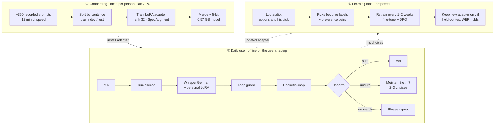

# Personal Voice Control for Dysarthria

## TL;DR

Standard speech recognition fails for people with dysarthria: the best open
German Whisper model got more than half the words wrong for our speaker
(55.4% WER). With **12 minutes** of his speech and a small LoRA adapter we cut
that to **13.2%**, and a phonetic repair step based on Kölner Phonetik brings it
to **10.7%**. The system runs offline on a laptop, asks before acting when it is
unsure, and in a command test it never executed a wrong command.

The adapter does **not** transfer to other speakers; it makes them worse
(60.6% → 109.4% WER). So the next step is an onboarding method that gives each
person their own adapter, needs as little recording as possible, and keeps
learning from the options each user picks.

- **Model:** [whisper-large-v3-turbo-german-lora (q5_0, whisper.cpp)](https://huggingface.co/alejandroniculescu/whisper-large-v3-turbo-german-lora-20260923-182243-q5_0.bin)
- **Coming next:** a second version built on **wav2vec2** (CTC), to compare
  against Whisper. CTC models emit characters frame by frame without a language
  model decoder, so they cannot loop or invent fluent text, and their output
  suits the phonetic repair step.
- **After that:** an **ImageBind** experiment. ImageBind maps audio, text,
  images and other modalities into one embedding space, so a spoken command
  could be matched to its meaning directly, as a second opinion next to the
  transcript, and video of the lips could be added later.

The speaker is anonymized. No audio or transcripts of his speech are in this
repository; examples below are generic German words.

## Headline numbers

Held-out test set, 39 clips of sentences never seen in training.

| System | WER | CER |
| --- | ---: | ---: |
| Base German Whisper | 55.4% | 24.4% |
| Base + phonetic snap | 53.7% | 24.8% |
| + personal LoRA | 13.2% | 4.3% |
| + LoRA + phonetic snap | **10.7%** | **4.0%** |
| Other German dysarthric speakers (125 clips), base | 60.6% | 32.5% |
| Other German dysarthric speakers, + his LoRA | 109.4% | 68.3% |

Command replay (15 commands): 12 accepted (all correct), 2 confirmed (correct),
1 repeat, **0 wrong commands executed**.

WER above 100% means the output has more wrong or inserted words than the
reference has words.

## Pipeline

## Why phonemic repair: the WER–CER gap

- **After adaptation, errors are small.** With the LoRA, WER is 13.2% but CER
  only 4.3%. Most wrong words are off by a letter or two (*geklabt* for
  *geklappt*, *Seben* for *Sieben*). A near-miss costs a full word in WER.
  Kölner Phonetik gives near-miss words the same code, and a weighted edit
  distance prefers dysarthric confusions (voicing, dropped h, doubled
  consonants). Snap lowers WER 13.2% → 10.7% while CER barely moves.
- **Before adaptation, errors are too large.** Base CER is 24.4%: whole words
  are wrong. Snap barely helps there (55.4% → 53.7%).
- **So the order matters:** the adapter gets the output close in sound, then
  sound-based repair finishes the job.

Kölner Phonetik groups letters into sound classes. It approximates phonemes; a
true phoneme-level analysis (G2P + forced alignment) is proposed below.

## Algorithm inventory

Status: ✅ measured in the best system · 🔧 built, not used in best model ·
❌ tried, made things worse · 💡 proposed.

| Layer | Algorithm | Module | Evidence | Status |
| --- | --- | --- | --- | --- |
| Data | Recording protocol: sustained vowel, pa-ta-ka (DDK), free speech, Grandfather passage, commands; phone recorder over HTTPS + token | `recorder.py` | 352 clips: 278 train (11.9 min), 35 dev, 39 test | ✅ |
| Data | Split by transcript hash, so a sentence never lands in two splits | `manifest.py` | All numbers here | ✅ |
| Acoustic | Silence trimming, 16 kHz mono | `preprocess.py` | Dev WER raw 58.4% → trim 57.7% | ✅ |
| Acoustic | High-shelf EQ, tempo ×1.2 | `preprocess.py` | 59.1% / 62.0%, worse | ❌ |
| Acoustic | Augmentation: speed, low-pass, reverb, noise, gain | `augment.py` | Not yet evaluated | 🔧 |
| Acoustic | Synthetic speech (TTS, slowed, low-passed) | `synth.py` | Not yet evaluated | 🔧 |
| Model | Base: primeline/whisper-large-v3-turbo-german (4-layer decoder, weak language prior) | — | Dev WER 57.7% | ✅ |
| Model | LoRA r=32, α=64, dropout 0.05 on q/k/v/out/fc1/fc2, encoder + decoder; lr 5e-4, 10 epochs, patience 3 | `train.py` | Dev WER 59.1% → 13.9% | ✅ |
| Model | SpecAugment (5% time, 5% frequency masks) | `train.py` | In best run | ✅ |
| Model | DoRA | `train.py --dora` | Not yet compared | 🔧 |
| Model | Merge + ggml q5_0, whisper.cpp on Metal | `ggml.py`, `cpp.py` | 0.57 GB, same WER as f16 | ✅ |
| Model | Learning from the user's choices (labels + DPO) | — | Choices already offered | 💡 |
| Decoding | Loop guard: token cap by clip length, repeat collapse | `guard.py` | Stopped a 137% WER blow-up | ✅ |
| Decoding | Personal phrase prompt | `questions.py` | Dev 57.7% → 54.7% (base) | ✅ |
| Decoding | Per-question soft GBNF grammar | `questions.py` | Command dialog | ✅ |
| Decoding | Token confidence (min p < 0.5 → confirm) | `questions.py` | Resolve step | ✅ |
| Phonetic | Kölner Phonetik | `phonetic.py` | Basis of snap | ✅ |
| Phonetic | Weighted edit distance (voicing, h, doubling at half cost) | `snap.py` | Ranks candidates | ✅ |
| Phonetic | Non-word snap (wordfreq) + command snap | `snap.py` | Test WER 13.2% → 10.7% | ✅ |
| Phonetic | Loose German sound variants (vocalized r, lost s, ch/sch, pf, umlauts) | `phonetic.py` | Dev 11.0% → 8.8%, test unchanged | 🔧 |
| Linguistic | Local LLM rewrite gated by sound | `llmfix.py` | Dev 10.9% → 15.3% | ❌ |
| Linguistic | LM rescoring of snap candidates | — | Design ready | 💡 |
| Dialog | Resolve: accept / confirm / repeat, up to 3 choices | `questions.py` | 0 wrong commands in 15 | ✅ |
| Dialog | Home-control slot dialog (device, room, action) | `home.py` | Live demo | ✅ |
| Evaluation | WER/CER with German normalization (ß→ss, digits, letter names, hyphens) | `text.py`, `evaluate.py` | Adapter 14.9% → 13.2% | ✅ |
| Evaluation | Cross-speaker transfer test | `scripts/external_dysarthric_german.py` | 109.4% vs 60.6% | ✅ |

## Levels of analysis

| Level | Used today | Proposed |
| --- | --- | --- |
| Acoustic | Log-mel inside Whisper; trimming; augmentation | Formants F1/F2, vowel space area, FCR; eGeMAPS (openSMILE) |
| Voice quality | — | F0, jitter, shimmer, HNR (Praat/parselmouth) |
| Prosody / timing | Loop guard uses clip length | Speech rate, pauses, DDK rate |
| Phonetic | Weighted dysarthric edit distance | Learn confusion costs per speaker |
| Phonemic | Kölner Phonetik + German variants | G2P + forced alignment (Montreal Forced Aligner) |
| Lexical | wordfreq non-word detection; personal phrases | Personal vocabulary from accepted commands |
| Syntactic / semantic | Per-question grammars; slot filling | LM rescoring of phonetic candidates |
| Pragmatic | Confirm before acting | Per-user confirmation threshold |

## Learning loop (proposed)

When unsure, the system asks "Meinten Sie …?" with 2–3 options. Each pick gives
the correct text for that audio and the wrong texts the model found plausible.

1. **Confirmed labels:** picked option + audio become training pairs; retrain
   every 1–2 weeks.
2. **Preference learning (the RL part):** picked vs rejected options form
   preference pairs for Direct Preference Optimization (DPO).
3. **Rule tuning:** picks update snap's confusion costs and the confirmation
   threshold.

Safeguards: always offer "none of these"; train only on user choices, never on
self-accepted answers; the held-out test set never changes and a new adapter
ships only if test WER holds; review a sample of picks with a carer or
therapist; separate consent for storing daily-use audio.

## Next steps

1. Learning curve on existing data (2, 5, 12 minutes).
2. Evaluate augmentation, synthetic commands and DoRA.
3. Log choices in the demo (with consent).
4. LM rescoring of snap candidates.
5. Acoustic profile from protocol recordings (formants, F0, jitter/shimmer, DDK).
6. Check the German sound-variant rules in snap on a second speaker (dev 11.0% → 8.8%, test unchanged, so possibly overfit).
7. Contact clinical and linguistics partners; start ethics application.
8. LoRA vs full fine-tuning at 12 minutes (Huber et al. found full fine-tuning
   better with many hours).
9. **wav2vec2 version** of the recognizer (CTC, German XLS-R base) with the same
   splits, snap and dialog, for a direct comparison with Whisper.
10. **ImageBind experiment:** match audio embeddings of his commands against
    text embeddings of the command list, and compare with transcript + snap.
    Later, add lip video as a second input. Note: ImageBind weights are
    CC BY-NC 4.0 (research use only).
11. Grant draft.

## Funding plan

1. **Recruit and record** 10–20 German speakers with dysarthria across causes,
   with ethics approval and consent; ~350 prompts (~12 min) each.
2. **Learning curve:** least data that works per person.
3. **Pooled starting point:** shared dysarthric adapter + small personal one.
4. **Acoustic severity profile:** does it predict adaptation gain?
5. **Home trial with the learning loop:** accept/confirm/repeat rates, wrong
   actions, WER over weeks.

Budget lines: participant sessions, compute (one lab GPU), research assistant,
clinical and linguistic partners, home-trial hardware.

## Related work

| Work | Setup | Result | Relevance |
| --- | --- | --- | --- |
| Huber, Kernahan & Waibel 2026 [1] | One German dysarthric speaker, Whisper full fine-tuning, 92 h + 8.8 h corrections | 15.8% (1.4 h), 10.7% (22.5 h), 9.7% (all + corrections) | Closest work. We use 12 min (different speaker and test set, not directly comparable). Corrections help, supporting our learning loop. |
| Project Euphonia [2–5] | English, >1M utterances, per-speaker models | Up to 85% lower WER; beats human listeners on short phrases | 63% of speakers reach target WER for home automation with 3–4 min [4] |
| VI LoRA [6] | Bayesian LoRA; UA-Speech + German child | More data-efficient | Alternative adapter; uncertainty for when to ask |
| Eckert & Schuppler 2025 [7] | Austrian German child, ataxic dysarthria | Small-data comparison | German small-data case |
| Baskar et al. 2022 [8]; AdAIS [9] | wav2vec2 + speaker-adaptive features, German validation | Gains across severity | wav2vec2 baseline family |
| ISi-Speech [10] | German speech-training app (BMBF) | App "Sprechen!" | German funding precedent |
| Rexeis et al. 2012 [11] | Acoustic + lexical adaptation | Early German work | Historical baseline |

## References

1. Huber, C., Kernahan, L., & Waibel, A. (2026). Adapting Foundation ASR Models to Dysarthric Speech: A Case Study. [arXiv:2606.31722](https://arxiv.org/abs/2606.31722)
2. Google Research. [Project Euphonia](https://sites.research.google/euphonia/about/)
3. Shor, J., et al. (2019). Personalizing ASR for Dysarthric and Accented Speech with Limited Data. Interspeech 2019. [arXiv:1907.13511](https://arxiv.org/abs/1907.13511)
4. Tobin, J., & Tomanek, K. (2022). Personalized Automatic Speech Recognition Trained on Small Disordered Speech Datasets. ICASSP 2022. [arXiv:2110.04612](https://arxiv.org/abs/2110.04612)
5. Green, J. R., et al. (2021). Automatic Speech Recognition of Disordered Speech: Personalized Models Outperforming Human Listeners on Short Phrases. Interspeech 2021. [ISCA](https://www.isca-archive.org/interspeech_2021/green21_interspeech.html)
6. Variational Low-Rank Adaptation for Personalized Impaired Speech Recognition (2025). [arXiv:2509.20397](https://arxiv.org/abs/2509.20397)
7. Eckert, L., & Schuppler, B. (2025). Automatic Speech Recognition for a Dysarthric Child Speaking Austrian German. Forum Acusticum Euronoise 2025. [PDF](https://dael.euracoustics.org/confs/fa2025/data/articles/000168.pdf)
8. Baskar, M. K., et al. (2022). Speaker adaptation for Wav2vec2 based dysarthric ASR. Interspeech 2022. [arXiv:2204.00770](https://arxiv.org/abs/2204.00770)
9. [AdAIS: Adaptation of ASR for Impaired Speech with minimum resources](https://www.humane-ai.eu/project/tmp-012/). Humane AI Net.
10. Fraunhofer IDMT. [ISi-Speech](https://www.idmt.fraunhofer.de/en/institute/projects-products/projects/isi-speech.html)
11. Rexeis, S., Petrik, S., & Kubin, G. (2012). Automatische Spracherkennung für Sprecher mit Dysarthrie. DAGA 2012.
12. Radford, A., et al. (2023). Robust Speech Recognition via Large-Scale Weak Supervision. ICML 2023. [arXiv:2212.04356](https://arxiv.org/abs/2212.04356)
13. Hu, E. J., et al. (2022). LoRA: Low-Rank Adaptation of Large Language Models. ICLR 2022. [arXiv:2106.09685](https://arxiv.org/abs/2106.09685)
14. Park, D. S., et al. (2019). SpecAugment. Interspeech 2019. [arXiv:1904.08779](https://arxiv.org/abs/1904.08779)
15. Postel, H. J. (1969). Die Kölner Phonetik. IBM-Nachrichten 19, 925–931.
16. Rafailov, R., et al. (2023). Direct Preference Optimization. NeurIPS 2023. [arXiv:2305.18290](https://arxiv.org/abs/2305.18290)
17. Rudzicz, F., Namasivayam, A. K., & Wolff, T. (2012). The TORGO database. Language Resources and Evaluation 46(4).
18. Kim, H., et al. (2008). Dysarthric speech database for universal access research (UASpeech). Interspeech 2008.
19. [Speech Accessibility Project](https://speechaccessibilityproject.beckman.illinois.edu/), University of Illinois.
20. [chuber/dysarthric-speech](https://huggingface.co/datasets/chuber/dysarthric-speech) (gated, CC BY-NC 4.0; dataset of [1]).
21. [B-Czarnetzki/dysarthric_german](https://huggingface.co/datasets/B-Czarnetzki/dysarthric_german) (no license stated; internal comparison only).
22. Liu, S.-Y., et al. (2024). DoRA: Weight-Decomposed Low-Rank Adaptation. ICML 2024. [arXiv:2402.09353](https://arxiv.org/abs/2402.09353)
23. Eyben, F., et al. (2016). The Geneva Minimalistic Acoustic Parameter Set (GeMAPS). IEEE Trans. Affective Computing 7(2).
24. McAuliffe, M., et al. (2017). Montreal Forced Aligner. Interspeech 2017.
25. Baevski, A., et al. (2020). wav2vec 2.0: A Framework for Self-Supervised Learning of Speech Representations. NeurIPS 2020. [arXiv:2006.11477](https://arxiv.org/abs/2006.11477)
26. Girdhar, R., et al. (2023). ImageBind: One Embedding Space To Bind Them All. CVPR 2023. [arXiv:2305.05665](https://arxiv.org/abs/2305.05665)
27. Software: whisper.cpp / ggml, PEFT, wordfreq, Praat.
